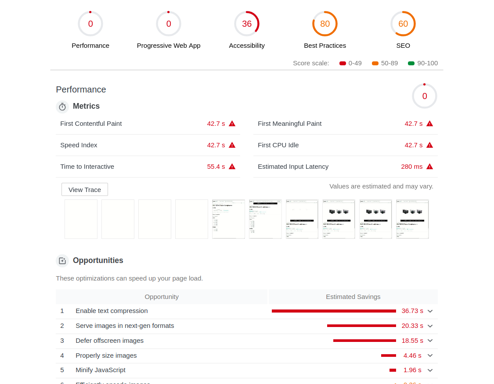
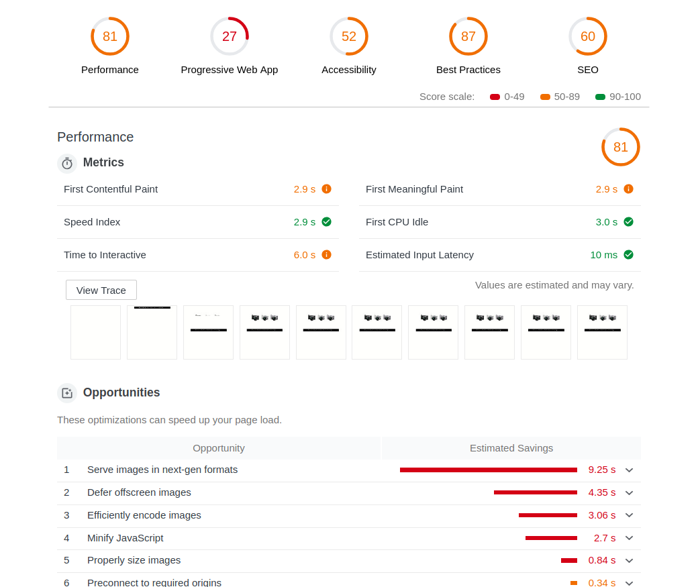
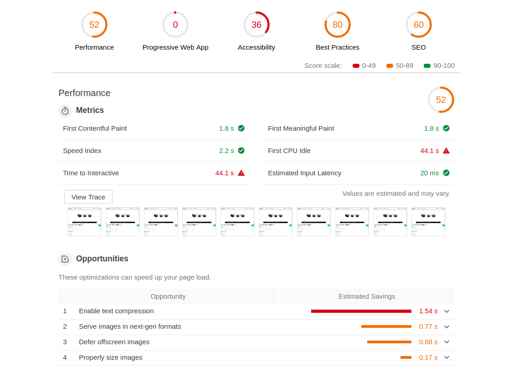

# massdrop-carousel
Carousel implementation imitating Massdrop's carousel feature on item details page


Massdrop-carousel is an implementation of the image carousel component of Massdrop's item details page using raw HTML and CSS. This component is built as a fullstack application utilizing Express and SQL to serve data to the front-end component made using React.

## Related Projects

## Dependencies
- [React](https://reactjs.org/docs/getting-started.html) front-end framework
- [Node.js](https://nodejs.org/en/)
- [Express.js](https://expressjs.com/)
- Testing
  - [Jest](https://jestjs.io/)
  - [Enzyme](https://airbnb.io/enzyme/)

## Getting Started
After cloning the Repo to your machine move to root directory
```
# Install dependencies
npm install

# Run database seeder
node db/dbSeeder.js

# Run the server locally
node server/server.js
```
## Performance Optimzations
Performance before optimization on 3g network:
- 
Performance after optimization on 3g network:
- 
Performance before optimization without throttling:
- 
Performance after optimization without throttling:
- 
